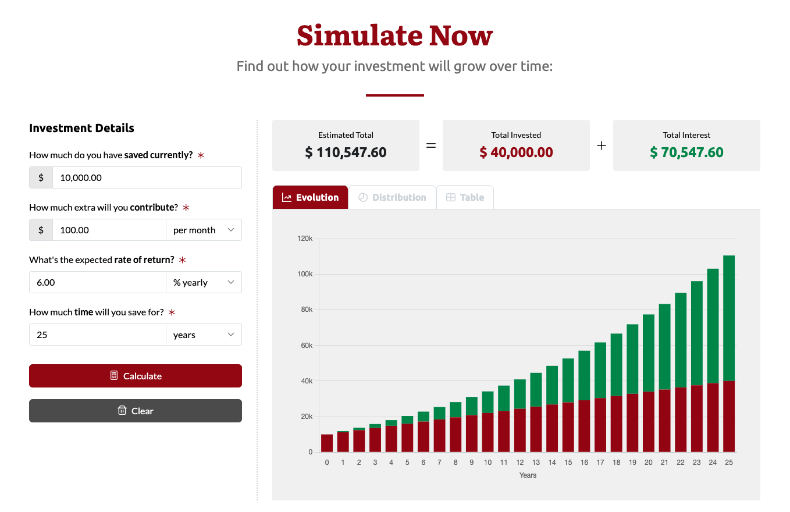

#  [React Compound Interest Calculator](https://ryanbalieiro.github.io/react-compound-interest-calculator/) 

A React-based tool designed to visualize the growth of investments through compound interest. 

This tool automatically calculates and compounds interest, providing detailed reports that include both charts and tables. Users can easily track their estimated total growth over the years and watch how their interest adds up alongside the money they've invested. It's a simple way to see how your investments grow

## [Preview](https://ryanbalieiro.github.io/react-compound-interest-calculator/)
You can explore and play around with the calculator by accessing a live version available **[here](https://ryanbalieiro.github.io/react-compound-interest-calculator/)**.

Below is an example scenario that starts with an initial investment of $10,000.00, with an additional contribution of $100.00 every month, at an annual interest rate of 6% over a period of 25 years:



## Status


## Installation and deployment

1. Clone the repo:
```
git clone https://github.com/ryanbalieiro/react-compound-interest-calculator
```

2. Go to the project's root folder and use npm to install all required components:
```
npm install
```

3. Launch the project in developer mode:
```
npm run dev
```

4. For a production build, go to `vite.config.js` and configure the base directory for your application. This setting establishes the primary path under which your website will be hosted.
```js
export default defineConfig({
  base: '/',
  plugins: [vue()],
})
```

5. Run the following command to compile the project into `dist`:
```
npm run build
```

6. If your deployment is targeted at GitHub Pages, ensure to run the following build command:
```
npm run ghdeploy
```

This command will build the project and make a copy of `index.html` named `404.html` inside the dist folder, serving as a workaround to the problem discussed in detail at https://stackoverflow.com/questions/48521177/404-when-reloading-a-vue-website-published-to-github-pages.

## About

This project was created by and is maintained by **[Ryan Balieiro](https://ryanbalieiro.com/)**. It was made possible using the following libraries and frameworks:
- [React](https://reactjs.org/) – A popular JavaScript library for building UIs.
- [Vite](https://vitejs.dev/) – A frontend tool for building web applications
- [React Router Dom](https://reactrouter.com/) – A library for routing and navigation in React applications.
- [ChartJS](https://www.chartjs.org/) – A JavaScript library for creating charts.
- [FontAwesome](https://fontawesome.com/) – A library of icons for web projects.
- [Bootstrap 5](https://getbootstrap.com/) – A responsive CSS framework.

## Copyright and License

Code released under the [MIT](https://github.com/ryanbalieiro/react-compound-interest-calculator/blob/master/LICENSE) license.